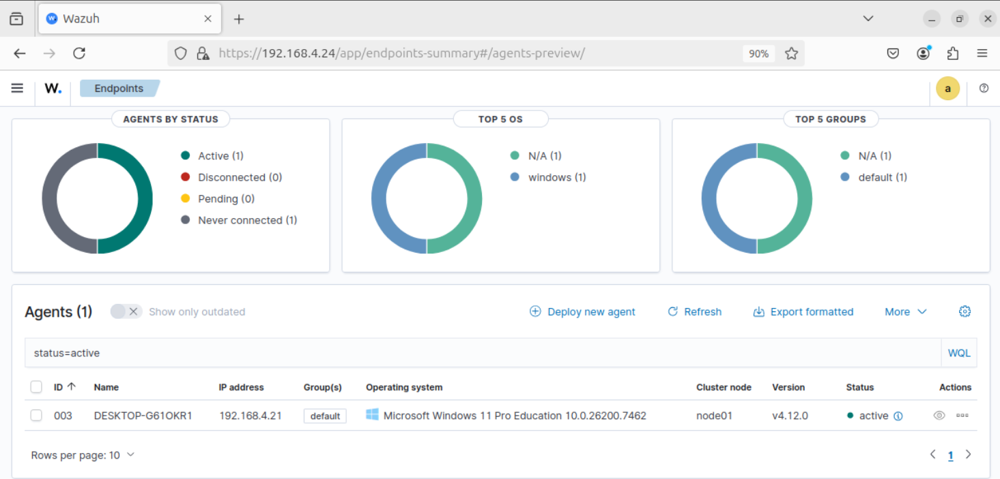
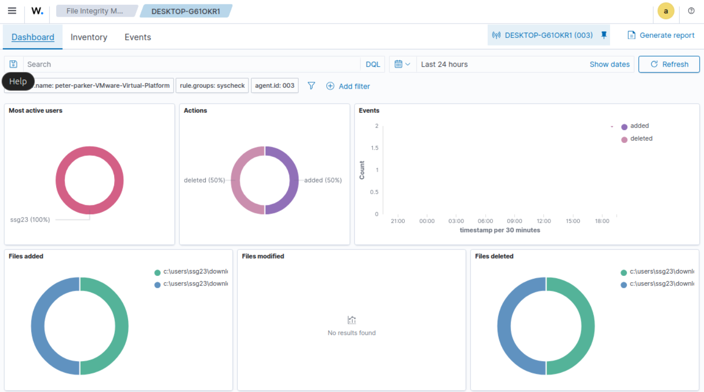
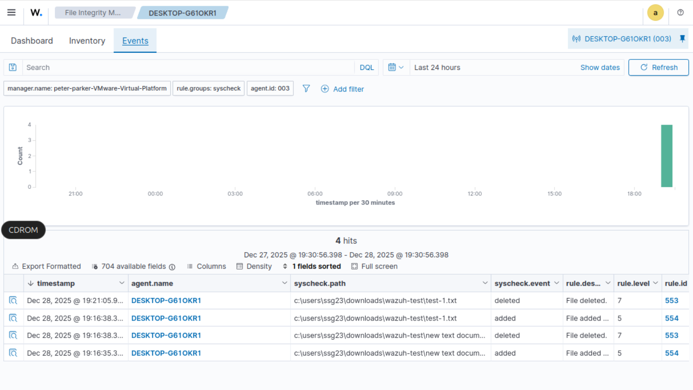

# SIEM
Wazuh SIEM Lab: Deployed a Manager/Agent architecture using Ubuntu (VMware) and Windows. Configured real-time File Integrity Monitoring (FIM) via Syscheck to track unauthorized system changes. Successfully resolved network bridging and versioning hurdles to maintain telemetry uptime. A hands-on project in endpoint security and log analysis.
# Wazuh SIEM & File Integrity Monitoring (FIM) Lab

## 🚀 Overview
Deploys a functional Security Information and Event Management (SIEM) environment to monitor host-based activity and strengthen threat detection. This lab uses a Manager/Agent architecture to track system telemetry and unauthorized file changes in real-time.

## 🏗️ Lab Architecture
* **SIEM Manager:** Ubuntu Server (running on VMware Workstation).
* **Endpoint Agent:** Windows 11 (Host Machine).
* **Network:** Configured via Bridged Networking to enable seamless communication between the VM and the host.

*Above: Logical topology showing the communication flow between the host agent and the virtualized manager.*

## 🛠️ Configuration & Implementation
1. **Manager Setup:** Installed the Wazuh Manager and Indexer on Ubuntu via automated scripts.
2. **Endpoint Deployment:** Provisioned a Windows Wazuh Agent and established a secure connection using cryptographic keys[cite: 6, 7].
3. **FIM Activation:** Configured the `ossec.conf` file to monitor a specific test directory using the **Syscheck** module with `realtime="yes"`.

## 🔧 Technical Troubleshooting (Key Highlight)
**Challenge:** Encountered a `4101` connection error where the agent failed to appear in the dashboard.
**Diagnosis:** Analyzed `ossec.log` and identified a version mismatch: the Manager was running v4.12 while the Agent was v4.14.
**Resolution:** Performed a clean uninstall of the agent and deployed the matching v4.12 MSI package, resulting in immediate successful telemetry synchronization.

## 📊 Project Evidence: Dashboard & Alerts
Below is the confirmation of the successful deployment, showing the Windows Agent reporting as **Active** and the File Integrity Monitoring (FIM) module capturing real-time file events.

*Above: Confirmed connectivity of Agent 003 running version 4.12.0.*

*Above: Captured "Added" and "Deleted" file events during the testing phase.*

*Above: Detailed log entry showing the specific file path and rule ID (553/554) for file modifications.*

## 📊 Results
* **Real-time Alerting:** Successfully triggered and analyzed "File Added" and "File Deleted" alerts in the Wazuh Dashboard after modifying the monitored test directory.
* **System Telemetry:** Verified 100% agent uptime and secure data transmission over ports 1514 and 1515.
